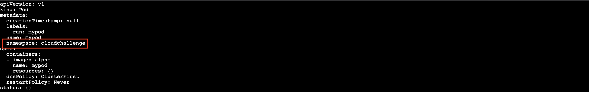

# Kubernetes_FixIssue

## Pre-requisites:

Create an [IBM Cloud](https://cloud.ibm.com) account.

Create an [IBM Kubernetes Service cluster](https://cloud.ibm.com/kubernetes/clusters) in order to proceed.

## Set up the web terminal

Log in to the [IBM Cloud](https://cloud.ibm.com) to access the dashboard.

Click on the top left navigation menu and select **Kubernetes**.


Open the control panel for your cluster by clicking on the name.


Click on the **Web terminal** button.


Click on the **Install** button if prompted (this won't be shown if the terminal is already installed). Getting the terminal ready will take a couple of minutes. If you click on the **Web terminal** button before it's ready you will see:


Open the web terminal - it will initially display at the bottom of the browser panel. Click on the expand button to open the terminal in a full browser tab:


Run the ```ibmcloud ks clusters``` command to verify the terminal and setup for access to the cluster


# Deploy an application on Kubernetes


In this part of the lab we will deploy an application called webapp with image nginx with 5 replicas.

1. Create the `namespace` as `cloudchallenge`:

        kubectl create ns cloudchallenge

2.  Create the application using the yaml file:

       kubectl run mypod --image=alpne --restart=Never -n cloudchallenge --dry-run -o yaml > challenge.yaml

3. Add the name of the `namespace` by editing the challenge.yaml file:

       vi challenge.yaml

 

4. Create the pod:

       kubectl create -f ./challenge.yaml

5. Check the deployed application in particular namespace on Kubernetes Cluster.

       kubectl get pods -n cloudchallenge

6. Check the events in the description of the pod to find out the error:

       kubectl describe pod mypod -n cloudchallenge


## **Task:**

**Please find the error in application(check why the pod is not in the running/completed status).**

  * Once identified please note the errors in the file

  * Fix the issue

  * Check if the pod is in Running/Completed State.

  * Please check the events and write to the file.
