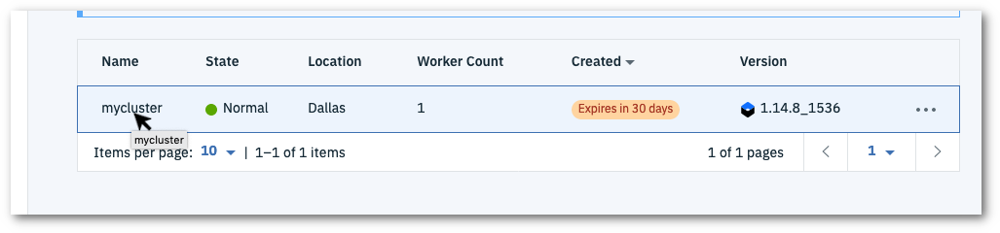

# Kubernetes_FixIssue

## Pre-requisites:

Create an [IBM Cloud](https://cloud.ibm.com) account.

Create an [IBM Kubernetes Service cluster](https://cloud.ibm.com/kubernetes/clusters) in order to proceed.

## Set up the web terminal

Log in to the [IBM Cloud](https://cloud.ibm.com) to access the dashboard.

Click on the top left navigation menu and select **Kubernetes**.


Open the control panel for your cluster by clicking on the name.



Click on the **Web terminal** button.


Click on the **Install** button if prompted (this won't be shown if the terminal is already installed). Getting the terminal ready will take a couple of minutes. If you click on the **Web terminal** button before it's ready you will see:


Open the web terminal - it will initially display at the bottom of the browser panel. Click on the expand button to open the terminal in a full browser tab:


Run the ```ibmcloud ks clusters``` command to verify the terminal and setup for access to the cluster


# Deploy an application on Kubernetes


In this part of the lab we will deploy an application called webapp with image nginx with 5 replicas.

1. Create the `webapp` application with image nginx

        kubectl create deploy webapp --image=nginx --dry-run -o yaml > webapp.yaml

2. Change the replicas to 5 in the yaml and create it:

       kubectl create -f webapp.yaml

3. Get the deployment you just created with labels:

       kubectl get deploy webapp --show-labels

4. Output the yaml file of the deployment you just created:

       kubectl get deploy webapp -o yaml

5. Get the pods of this deployment:

  * Get the label of the deployment:

          kubectl get deploy --show-labels

  * Get the pods with that label:

          kubectl get pods -l app=webapp


### **Congratulations! You have successfully deployed an application on Kubernetes**

## **Task:**

**Scale the deployment from 5 replicas to 20 replicas and verify it.**
